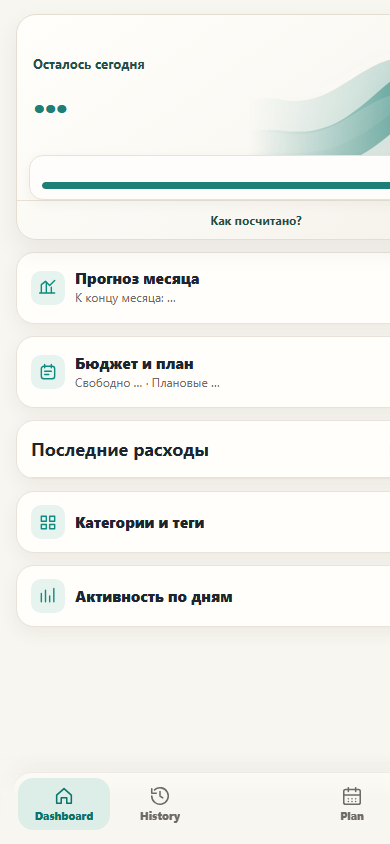
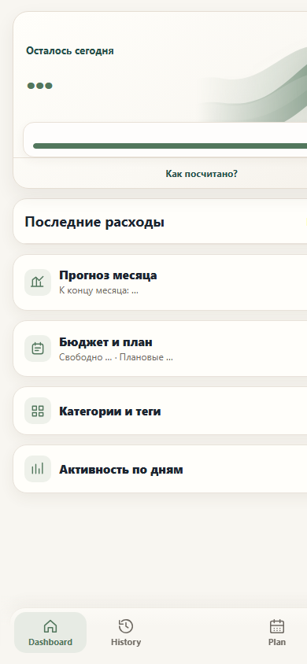
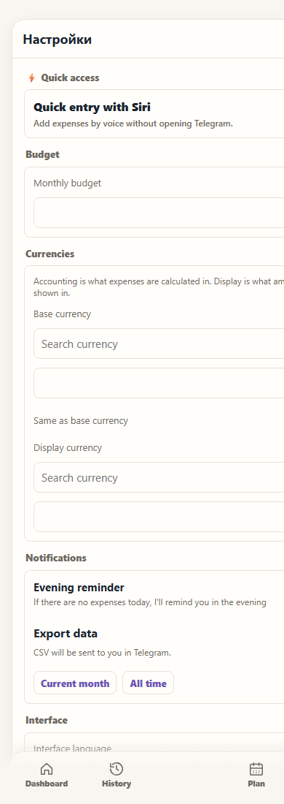
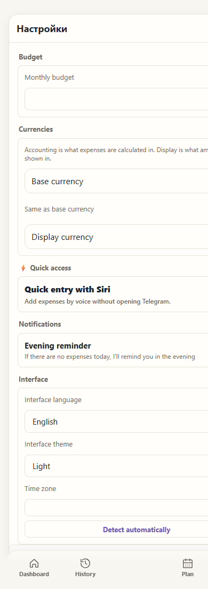
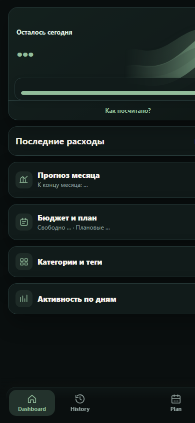

# Mini App UX and brand polish visual review

These screenshots use the local Mini App static server only. They contain no production data.

## Dashboard order

| Before | After |
| --- | --- |
|  |  |

The after view keeps the urgent recovery and planned-payment notices above recent expenses when those states exist. Recent expenses now precede the collapsed forecast and budget disclosures.

## Settings hierarchy

| Before | After |
| --- | --- |
|  |  |

The after view places Budget and Currencies first, collapses the currency controls, moves Quick Access lower, and puts export inside Data and privacy.

## Dark theme

The dark theme keeps the hero on the graphite surface while retaining the semantic green, warning, and danger colors.

## Verification scope

- Browser geometry was checked at 375, 390, and 430 CSS pixels; `documentElement.scrollWidth` matched `window.innerWidth` at every checked width.
- Light and dark themes were checked with the local source build.
- The collapsed and expanded currency disclosures and expanded Data and privacy section were inspected at 390 CSS pixels.
- The local Docker engine did not become ready during this run, so the guarded demo database could not be seeded. The screenshots therefore show static/skeleton content rather than populated synthetic expenses.
- Telegram iOS/Android device rendering was not available in this run and remains a pre-merge manual check.
