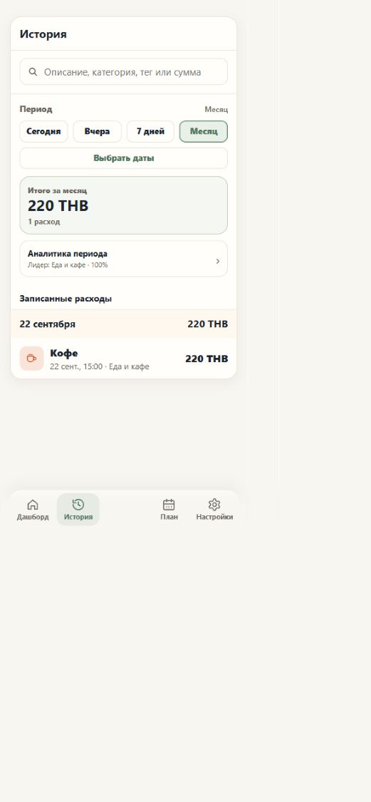
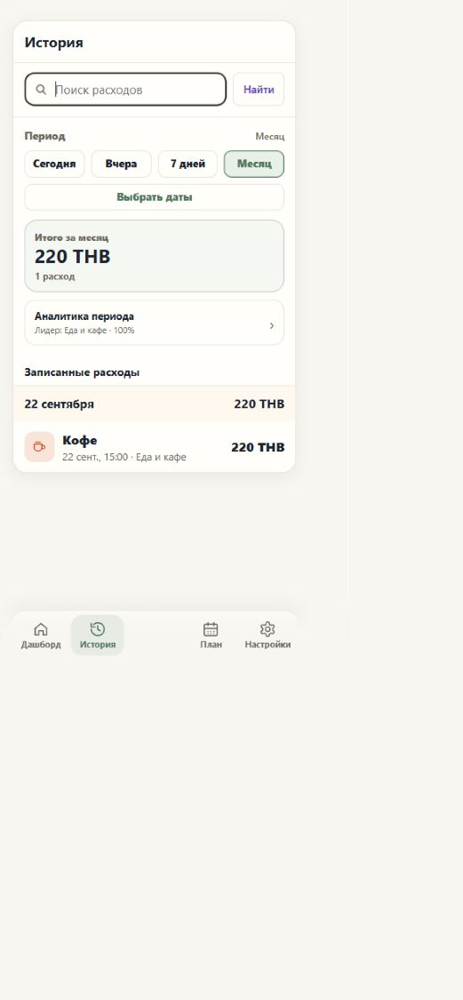
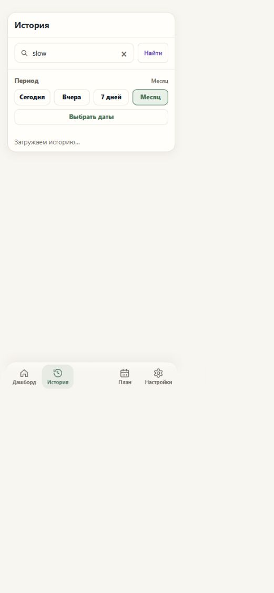
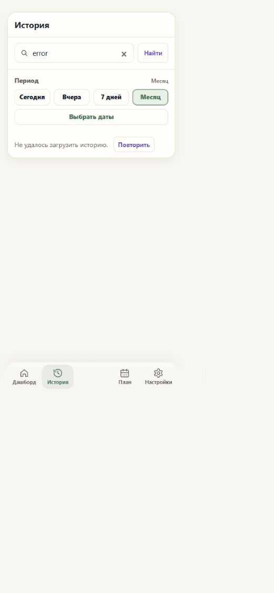
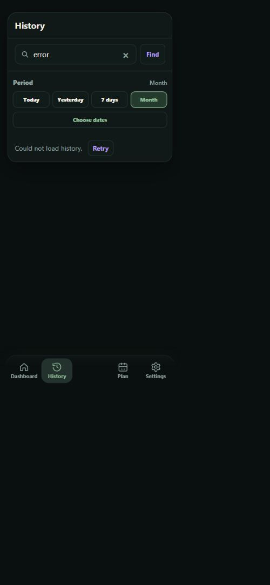

# Второй UX-проход: история

Объём: явный запуск поиска, загрузка, ошибка и повторная попытка. Плановые платежи и быстрый ввод проверены по коду; дополнительных изменений для них этот проход не потребовал.

| До | После |
| --- | --- |
|  |  |

| Загрузка | Ошибка с повтором |
| --- | --- |
|  |  |

## Проверка

- В браузере использованы исходные HTML/CSS/JS и вымышленные ответы локального HTTP-сервера. Только стартовый вызов dashboard заменён открытием History; Telegram SDK и настоящий API не использовались.
- До: исходники из `a4ee393`. После: рабочая ветка этого PR. Пример «Кофе, 220 THB» полностью синтетический.
- Проверены кнопка поиска, Enter, очистка, пустой результат, ошибка, повтор с успешным результатом и новый запрос во время медленного ответа. Старые строки, итоги и аналитика скрыты до завершения последнего запроса.
- Проверены RU/light и EN/dark. Фактическая ширина viewport и документа совпала при 375, 391 и 431 CSS px (округление браузерного масштаба для целевых 375/390/430).
- Скриншоты сохраняют вывод браузера с его масштабированием. Проверка настоящего Telegram WebView на телефоне не выполнена.

API, база данных и финансовые правила не изменены. Этот PR заканчивается ревью; merge и production deploy выполняются отдельно.
